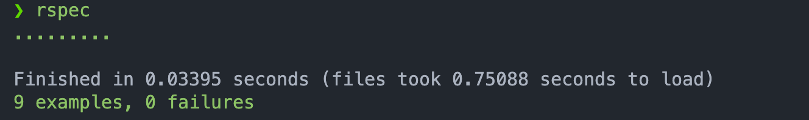
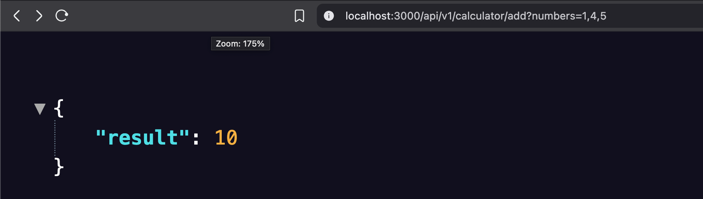
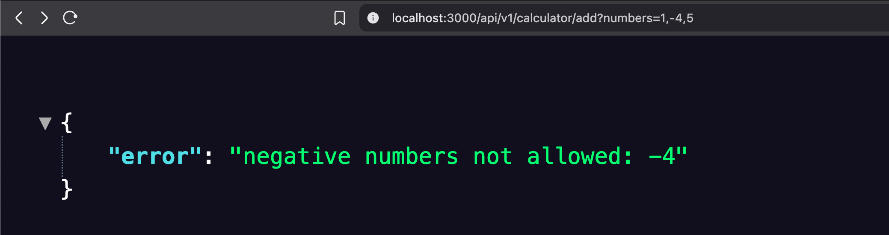

# String Calculator TDD Kata

This is a Ruby on Rails implementation of the String Calculator TDD Kata for the Incubyte TDD Assessment.

## Setup

1. Ensure Ruby 3.3.6 and Rails 8.0.2 are installed.
2. Clone the repository.
3. Run `bundle install` to install dependencies.
4. Run `rspec` to execute tests.

## Usage

The calculator is exposed via an API endpoint:

- **GET /api/v1/calculator/add?numbers=input**
  - Example: `curl http://localhost:3000/api/v1/calculator/add?numbers=1,2`
  - Response: `{"result":3}`

## Features

- Handles empty strings (returns 0)
- Supports single and multiple numbers
- Allows comma and newline separators
- Supports custom delimiters (e.g., `//;\n1;2`)
- Rejects negative numbers with an appropriate error message

## Development

- Tests are written using RSpec.
- The project follows TDD practices with frequent commits to show evolution.
- The main logic is in `app/models/string_calculator.rb`.

## Screenshots

  

  

## Final Notes

- The project is complete, meeting all kata requirements.
- The code is readable, testable, and follows TDD practices.
- The repository shows the evolution of the solution through commits.
- The API makes the calculator accessible for practical use.